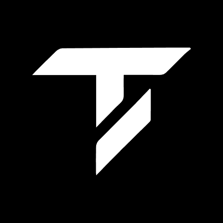

<p align="center">
  
</p>

<h1 align="center">Tekton</h1>

<p align="center">
  <strong>Trustless OTC Trading Desk on Bitcoin</strong><br/>
  Trade BTC and Rune tokens peer-to-peer with smart contract escrow.<br/>
  No middlemen. No custodians. Just code and Bitcoin finality.
</p>

<p align="center">
  Built on <a href="https://midl.xyz">MIDL Protocol</a> for VibeHack 2026
</p>

---

## The Problem

Traditional OTC desks require trust: you wire money and hope the other side delivers. Large BTC trades move through private Telegram groups, Discord channels, and custodial intermediaries who take a cut and hold your funds. Counterparty risk is the norm.

## The Solution

Tekton replaces trust with a Solidity escrow contract on MIDL Protocol, backed by Bitcoin L1 settlement.

- **Maker** creates an offer and locks their tokens + anti-spam BTC stake
- **Taker** reviews the offer, checks the maker's on-chain reputation, and accepts
- **Smart contract** executes the atomic swap: both sides receive funds simultaneously
- Nobody can run away with the money. The contract enforces the deal

---

## Features

### Trustless Escrow
All funds are held in `TektonEscrow.sol`, never by Tekton. The contract handles deposit, settlement, cancellation, and expiry with full reentrancy protection.

### On-Chain Reputation
Every trade updates your permanent on-chain profile: completion rate, trading age, volume. A confidence-adjusted score (0-100) builds gradually to prevent gaming.

```
score = (completion x 80 + age x 10 + volume x 10) x min(trades / 10, 1)
```

### Anti-Spam Stakes
Makers lock BTC collateral when creating offers. Cancelled or expired offers still cost gas and reputation. This keeps the order book clean.

### Private Offers
Restrict trades to a specific wallet address. Useful for prearranged deals where you already know your counterparty.

### P2P Messaging
Built-in chat between trade counterparties. Coordinate details without leaving the platform.

### Cancel Protection
30-minute cooldown on cancellations protects takers from rug-pulls. Once someone starts taking an offer, the maker can't yank it away.

---

## Supported Tokens (Regtest)

| Token | Type | Decimals |
|---|---|---|
| BTC | Native | 18 |
| WBTC | ERC-20 (Rune-backed)   |18|
| USDC | ERC-20 (Rune-backed)   | 6|
| TEKTON | ERC-20 (Rune-backed) | 0|

---

## Tech Stack

### Frontend

| Technology | Purpose |
|---|---|
| Next.js 14 (App Router) | React framework |
| wagmi + viem (@midl/viem fork) | Wallet connections + contract interaction |
| MIDL SDK (@midl/core, @midl/react) | Bitcoin L2 chain integration |
| Prisma v7 + SQLite | Messaging + auth session storage |
| Framer Motion | Animations |
| TailwindCSS | Styling |

### Smart Contracts

| Technology | Purpose |
|---|---|
| Solidity 0.8.28 | Escrow contract |
| Hardhat 2.28.3 | Development + deployment |
| OpenZeppelin 5.4.0 | ReentrancyGuard, SafeERC20, Ownable |

### Security

- Wallet-signature auth (personal_sign, 24h sessions)
- CSRF protection on all mutating API routes
- Rate limiting on auth and messaging endpoints
- Server-side text sanitization (control chars, RTL overrides, zero-width)
- CSP headers with nonce-ready architecture

---

## Project Structure

```
Tekton/
├── app/                          # Next.js frontend
│   ├── prisma/schema.prisma      # DB schema (messages, auth)
│   └── src/
│       ├── app/                   # Pages + API routes
│       ├── components/            # React components
│       ├── config/midl.ts         # Chain + token config
│       ├── hooks/                 # useAuth, useEscrow, useMidlTx
│       └── lib/                   # contract.ts, prisma.ts, api-auth.ts
├── contracts/
│   └── contracts/TektonEscrow.sol # Escrow smart contract (541 lines)
├── WHITEPAPER.pdf                 # Protocol whitepaper
└── README.md
```

---

## Live Demo

Tekton is deployed on MIDL Protocol Regtest. To try it:

1. Install the [Xverse Wallet](https://www.xverse.app/download) browser extension
2. Get test BTC from the [MIDL Faucet](https://faucet.midl.xyz/)
3. Visit the live app and connect your wallet

---

## Smart Contract

**TektonEscrow.sol** deployed on MIDL Regtest at `0x0FCF1E8F42B98299a44C2A4d1F06298808A5E326`

| Function | Purpose |
|---|---|
| `createOffer()` | Create and fund a trade offer |
| `acceptOffer()` | Accept and settle atomically |
| `requestCancel()` / `finalizeCancel()` | Two-phase cancel with 30-min cooldown |
| `reclaimExpired()` | Reclaim funds after offer expiry |
| `getProfile()` / `getReliabilityScore()` | On-chain reputation |

Platform fee: 0.3% of the counter-asset on settlement.

---

## MIDL Protocol Resources

- [SDK Documentation](https://js.midl.xyz/)
- [GitHub](https://github.com/midl-xyz/midl-js)
- [Regtest Faucet](https://faucet.midl.xyz/)
- [EVM Explorer](https://blockscout.staging.midl.xyz/)
- [Bitcoin Explorer](https://mempool.staging.midl.xyz/)
- [Xverse Wallet](https://www.xverse.app/download)

---

## License

All rights reserved. This software is proprietary and confidential. See [LICENSE](LICENSE) for details.
